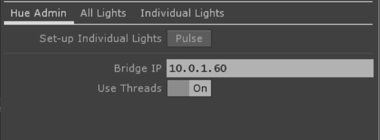
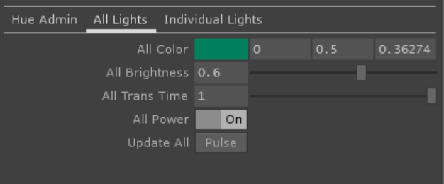
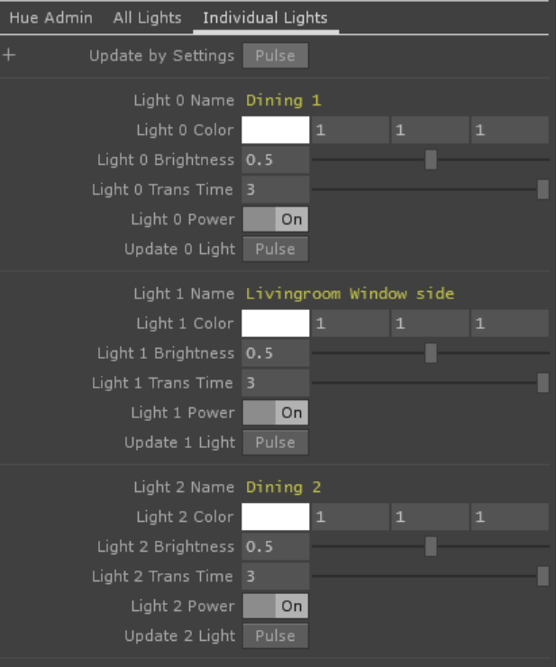

# TouchDesigner Hue Control
*a tox for controlling phillips hue devices*  
[matthew ragan](https://matthewragan.com)  
[zoe sandoval](https://zoesandoval.com)

## TouchDesigner Version
* 099 2018.26750

## OS Support
* Windows 10
* macOS

## Dependencies
* [phue](https://github.com/studioimaginaire/phue)

## Summary
Philips Hue smart lights are intended to be used in homes / studios. The devices come in many varieties - individual lamps, outdoor lights, LED strip lights, etc. These are synchronized by communicating with an additional device called a Bridge. A single Bridge can control up to 50 lights. There are many stand alone applications to drive Hue Lights, and this repo aims to provide some additional control by exposing those controls through TouchDesigner. In order to do this, we use the `phue` library. There is some additional set-up required in order to use an external library, though hopefully much of this is now streamlined.

This TOX provides global control for all lights, or individual control for single lights.

## Set-up
This module module has some additional requirements in the from of dependencies, as well as some set-up requirements for working with hue devices. To begin we need to ensure that we've collected all of the requisite external dependencies

### Install Python3
Ensure that you've installed a `Python 3.5+` variety.

### Installing Dependencies for Windows Users
For Window's users a convenience script is provided here:  
`\dev\dep\update-dep-python-windows.cmd`  
In order for this to operate correctly, right click and run this `.cmd` file as an Administrator. This should first ensure that your python package manager is updated, and that your additional python modules are added to a newly created directory in your project `dependencies\python`. 

### Installing Dependencies for macOS Users
For Mac users a convenience script is provided here:  
`\dev\dep\update-dep-python-mac.sh`  
In order for this to operate correctly, open a terminal window and drag the file above into the command line. Press return / Enter to run the bash script. This should first ensure that your python package manager is updated, and that your additional python modules are added to a newly created directory in your project `dependencies\python`. 

### Connecting to the Hue Bridge
Before being able to control lights you'll need to ensure that you can connect to your Hue Bridge. You'll need to know the IP address for your Hue Bridge. You can locate this IP address by looking at the Hue app on your phone, or by setting your Bridge to have an assigned IP on your router.

You'll need to enter the IP address of your Hue Bridge onto the component itself, and then press the large center button on the Hue Bridge. After doing this you'll need to pulse the `Set-up Individual Lights` button on the `base_hueControl` TOX.

## Parameters

### Hue Admin

#### Set-up Individual Lights
This parameter will retrieve the dictionary of lights that are currently configured on the Hue Bridge. This will then loop through all of the lights provided by the Bridge and create unique parameters for each light. Specifically it will create pars for:  
* Color
* Brightness
* Transition Time
* Power
* Pulse to Update

This gives the user the ability to control each light individual - constructing parameters for each light currently configured on a given bridge. 

#### Bridge IP
The IP address for the Hue Bridge - this is used for communicating with the lights by way of the Hue Bridge.

#### Use Threads
Python operations can sometimes be blocking - meaning that it causes touch to stop responding. By moving to threaded approach we can achieve a result where we can ensure that we don't totally stall. Lights can sometimes run slightly out of sequence when using threads, though in some cases this is well worth the fact that touch wont completely stall. 

#### All Lights

#### All Color
This color will be sent to all lights - you can think of this as a global color control. Color is expressed as normalized range of 0-1, with red, green, and blue channels.

#### All Brightness
Similar to color, this is the brightness control for all lights. This is expressed in a range of 0-1.

#### All Trans Time
This is the time between the issued command the settings sent to the light. This is expressed in seconds. If you enter a value of 0, the instructions will be sent immediately, though this often produces results that are stuttered.

#### All Power
This is the power command, the equivalent of "on" and "off".

#### Update All
After changing the settings for lights, you use this pulse button to send commands to the lights. This ensures that you can set the parameters before issuing a command to the lights. 

### Hue Admin

#### Update by Settings
This pulse button is on the top of the Individual Lighting control page. Unlike a global control, this will send instructions for the configuration of lights based on what's set ont this page - this in effect lets you send unique settings to each light.

#### Light n Name
This is a read only parameter that is the Name for a given light that the user has configured in one of the Hue Apps.

#### Light n Color
The color to send to a given light. Color is expressed as normalized range of 0-1, with red, green, and blue channels.

#### Light n Brightness
Similar to color, this is the brightness control a given light. This is expressed in a range of 0-1.

#### Light n Trans Time
This is the time between the issued command the settings sent to the light. This is expressed in seconds. If you enter a value of 0, the instructions will be sent immediately.

#### Light n Power
This is the power command, the equivalent of "on" and "off".

#### Update n Light
After changing the settings for a given light, you use this pulse button to send commands to the light. This ensures that you can set the parameters before issuing a command. 

## Known Issues
### mac OS
* scripting to pull python dependencies is still misbehaving. Currently, you'll need to set the permissions on this file manually in order to get it to run correctly. You can do this in terminal by doing the following:
    * open a terminal window
    * navigate in terminal to the `dep` directory
    * use the following command `sudo chmod 755 udpate-dep-python-mac.sh`
    * enter your password
    * drag `udpate-dep-python-mac.sh` file into terminal and hit enter

## Windows
* none that I know of... yet

## Credits
### Inspired by the work of:
[zoe sandoval](zoesandoval.com)  
[lightnotes](https://www.lightnotes.es/)  
[forum inspiration](https://www.derivative.ca/Forum/viewtopic.php?f=4&t=6131)

### Icons
[Material Design Icons by Google](https://material.io/tools/icons/?icon=save_alt&style=baseline)